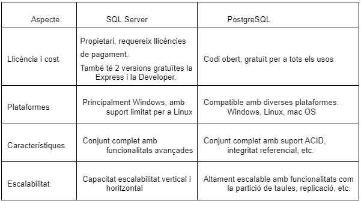

# Exemples d'us i Casos practics
Es la opció preferida de alguns degut al bon rendiment i de l’estabilitat del servidor.
 
-Una de les característiques que agrada més es que es natiu de Windows i està integrat a l’ecosistema de Windows.  
-Si t'interessa fer aplicacions .net amb tecnologies de Microsoft, SQL Server s’integra molt bé i ofereix un rendiment òptim.  
-SQL Server és conegut per la seva capacitat d’escalar tan verticalment com horitzontalment. Pot generar grans volums de dades i de càrregues de treball.  
-També ofereix una àmplia gamma de característiques de seguretat, incloent-hi xifrat de dades, auditoria, polítiques d'accés i autenticació integrada amb Active Directory.  
-Microsoft proporciona un conjunt d'eines robustes per administrar i monitoritzar bases de dades SQL Server, com SQL Server Management Studio (SSMS) i SQL Server Profiler.  
-SQL Server compta amb un ampli suport tècnic per part de Microsoft i una gran comunitat d'usuaris que poden proporcionar ajuda, recursos i solucions als problemes que puguin sorgir.  
 
Versions de la solució (Community Edition, Enterprise Edition, cloud...)  
En el nostre cas, escollirem la versió Express , ja que és totalment gratuïta.
Comparatiu amb altres bases de dades del seu segment.

