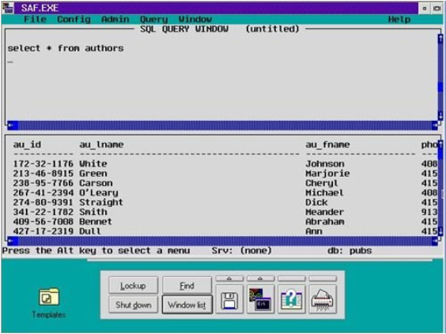
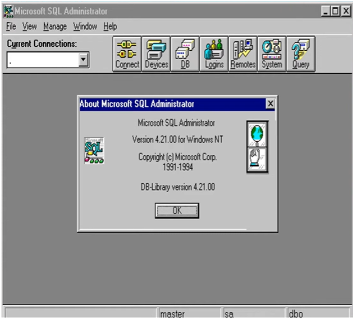
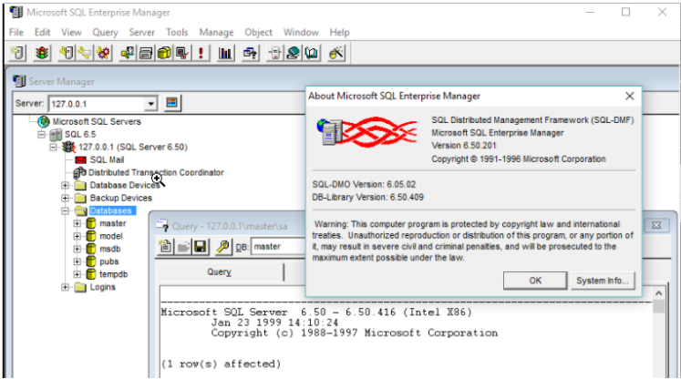
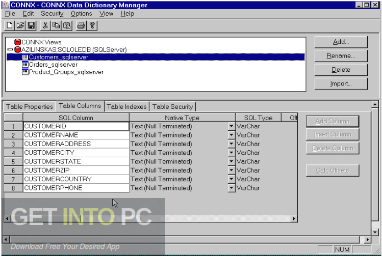
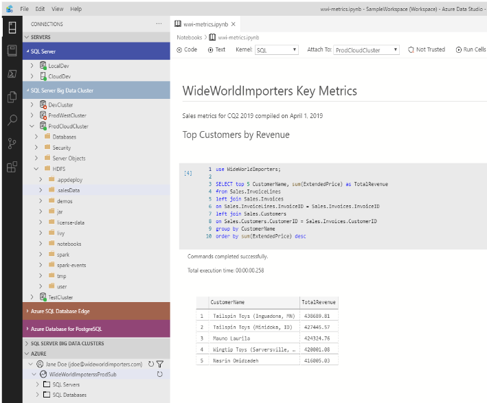

Descriure la historia de la base de dades escollida, i qui dóna suport.
La història de SQL Server: Sybase va crear el primer sistema de gestió de bases de dades relacionals (RDBMS) basat en SQL (Structured Query Language) Al 1980. Després, el 1989, Microsoft va adquirir la llicència de Sybase i va presentar la seva pròpia versió de SQL Server al 1993.
EVOLUCIÓ: SQL Server ha experimentat nombroses actualitzacions i millores. Cada nova versió ha portat innovacions significatives en rendiment, seguretat i funcionalitat.  
PRIMERA VERSIÓ: SQL Server 1.0 - Aquesta va ser la primera versió  després que Microsoft compres la llicència de Sybase. Ofereix característiques bàsiques d'un sistema de gestió de bases de dades relacionals, utilitzant SQL com a llenguatge de consulta.  
  

SEGONA VERSIÓ: SQL Server 4.21a (1993): Aquesta versió va marcar el llançament   inicial de SQL Server sota la marca de Microsoft. Va introduir millores en comparació amb la versió anterior de Sybase, com per exemple una millor compatibilitat amb Windows i suport per a procediments emmagatzemats i desencadenadors. 
  

TERCERA VERSIÓ: SQL Server 6.0 (1995): Aquesta versió va ser un gran avanç i va introduir diverses característiques importants, com ara OLAP (Processament Analític en Línia), replicació i suport per a bases de dades més grans. També va ser la primera versió que oferia una edició Enterprise 
  

	

QUARTA VERSIÓ: SQL Server 7.0 (1998): va portar una interfície gràfica 'usuari millorada amb Enterprise Manager i Query Analyzer. També es va millorar l'escalabilitat (la capacitat del sistema per gestionar un creixement en la quantitat de dades i la càrrega de treball sense disminuir el rendiment) i la capacitat de gestió (la facilitat i efectivitat amb què els administradors poden supervisar, controlar i mantenir el sistema de base de dades), la qual cosa va permetre la seva adopció en empreses de major mida.  
  

SQL Server 2000 (2000): Aquesta versió es va centrar en millorar l'escalabilitat i el rendiment, així com en introduir característiques com XML integrat, anàlisi de negoci i replicació millorada.  
  
