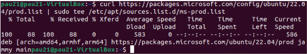

# Instal·lació i Configuració des d'un Ubuntu 22.04

```
sudo apt-get install curl 
```

<br>
```
curl -fsSL https://packages.microsoft.com/keys/microsoft.asc | sudo gpg --dearmor -o /usr/share/keyrings/microsoft-prod.gpg
```

```
sudo cp /usr/share/keyrings/microsoft-prod.gpg /etc/apt/trusted.gpg.d/
```

<br>
```
curl -fsSL https://packages.microsoft.com/config/ubuntu/22.04/mssql-server-2022.list | sudo tee /etc/apt/sources.list.d/mssql-server-2022.list
```


<br>
```
sudo apt-get update
```

<br>
```
sudo apt-get install -y mssql-server
```

<br>

```
sudo ACCEPT_EULA='Y' MSSQL_PID='Developer' MSSQL_SA_PASSWORD='WeNeedABetterPassword!!!1' MSSQL_TCP_PORT=1433 /opt/mssql/bin/mssql-conf setup
```

<br>
```
systemctl status mssql-server --no-pager
```

<br>
```
curl https://packages.microsoft.com/config/ubuntu/22.04/prod.list | sudo tee /etc/apt/sources.list.d/ms-prod.list
````

```
sudo apt-get update
```

```
sudo apt-get install -y mssql-tools18 unixodbc-dev
```


```
sudo /opt/mssql/bin/mssql-conf set sqlagent.enabled true
```


```
sudo systemctl restart mssql-server
```


```
sudo apt-get install -y net-tools
````


