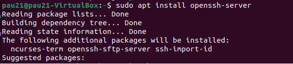
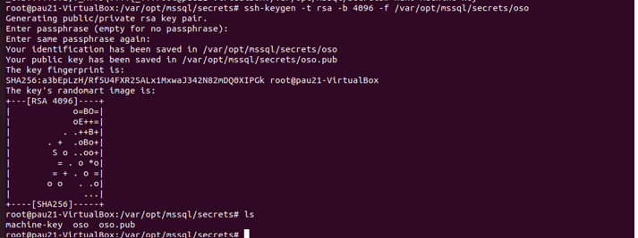
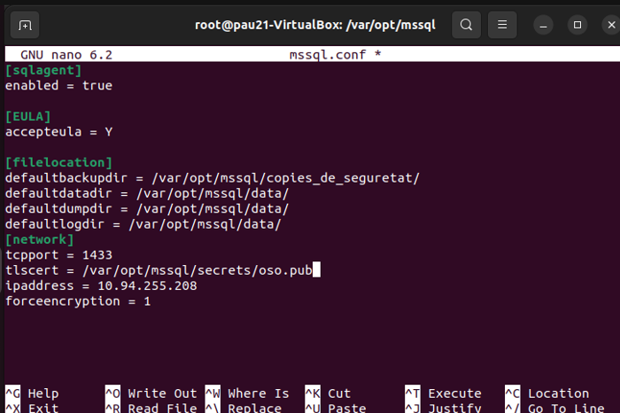
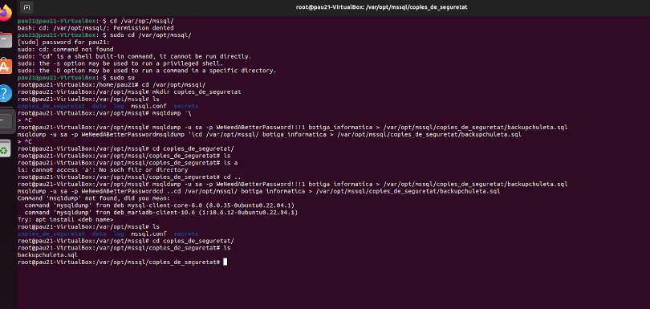

# Verifica i respon

1.  Un cop realitzada la instal·lació realitza una securització de la mateixa. Quin programa realitza aquesta tasca? Realitza una securització de la instal·lació. <br>
Primer de tot instal·lem el servei OpenSSH:
```
sudo apt install openssh-server
```
 <br>
Una vegada està instal·lat, creem el certificat:  <br>
<br>
```
ssh-keygen -t rsa -b 4096 -f /var/opt/mssql/secrets/oso
```
 <br>
<br>
Ara editem el fitxer "mssql.conf" ha de quedar així. Hem modificat els apartats de filelocation i network per tal que la base de dades es vinculi al certificat.

Finalment, configurem les còpies de seguretat
```
mysqldump -u sa -p WeNeedABetterPassword!!!1  botigainformatica > /var/opt/mssql/copies_de_seguretat/backupchuleta.sql
```

2.  Quines són les instruccions per arrancar / verificar status / apagar servei de la base de dades del SBGB escollit a nivell sistema operatiu? <br>
      Arrancar el servei: sudo systemctl start mysql-server.service <br>
      Verificar stat: sudo systemctl status mysql-server.service <br>
      Apagar el servei: sudo systemctl stop mysql-server.service <br>

3.  A on es troba i quin nom rep el fitxer de configuració del SGBD escollit? <br>
```
    /var/opt/mssql/mssql.conf <br>
```
4.  A on es troben físicament els fitxers de dades (per defecte). Com ho has sabut? <br>
```
    /var/opt/mssql/data   link <br>
```
5.  El servei de SGBD escollit en quins ports escolta. Quina modificació/passos caldrien fer per canviar aquest port a un altre per exemple? Important: No realitzis els canvis. Només indica els passos que faries. <br>
      Mysql server escolta per el port 1443. <br>
      Mitjançant aquesta comanda “sudo nano /var/opt/mssql/mssql.conf”, podem veure per quin port està escoltant el nostre servidor, desde aquest arxiu tenim que buscar l’apartat dels ports i canviar el port per el qual està escoltant. Un cop canviat tenim que guardar l’arxiu i reiniciar el servei amb aquesta comanda “sudo systemctl restart mysql-server.service”. <br>

6. Quin tipus de SGBD? (Relacional, no relacional, graf, document,....) <br>
	MySQL Server es un sgbd relacional. <br>
