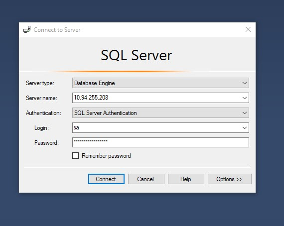
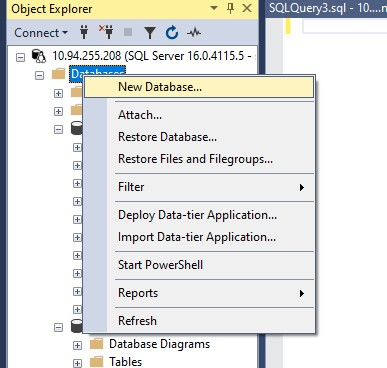
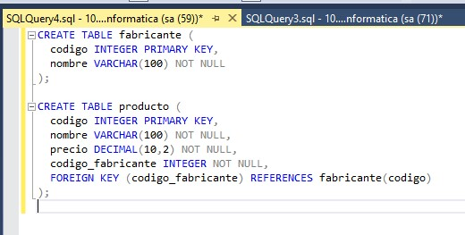
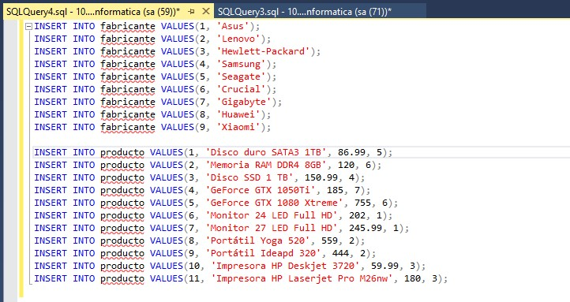

# Connectar-se i manipular
Aquí podrem veure com poder connectar-nos a la base de dades escollida i després com poder modificar (SELECT, UPDATE, INSERT, DELETE)

- Aqui tenim que entrar a la aplicacio de desktop 'SQL Server Managment Studio' i fer Login.

- Una vegada fet aixo tenim que anar a databases i fer click dret, una vegada fet aixo li donem a 'New Database...'.

- Seguidament estarem a una pantalla que on posa 'database name' posem el nom que voldrem. En el nostre cas posarem 'Botiga Informatica'.

- Despres de posar el nom tornarem a donar click dret i li donarem a 'New Query' on posarem els '.sql' de la database importada.

- Posem la informacio de Botiga Informatica

- Posem la informacio de Botiga Informatica

