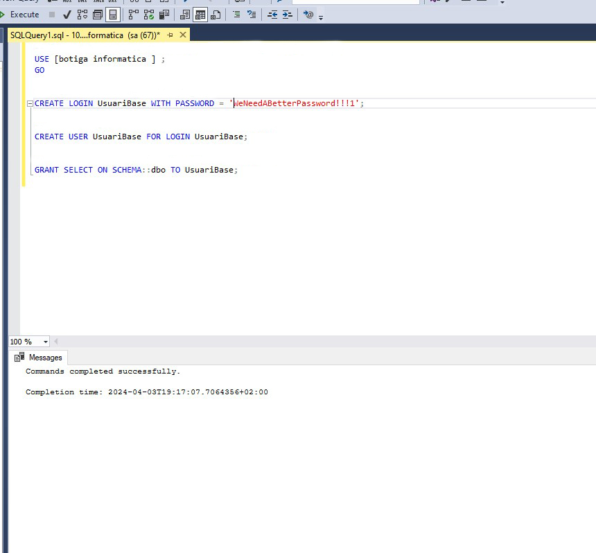

# Connectar-se i manipular
Aquí podrem veure com poder connectar-nos a la base de dades escollida i després com poder modificar (SELECT, UPDATE, INSERT, DELETE)

- Aqui tenim que entrar a la aplicacio de desktop 'SQL Server Managment Studio' i fer Login.

- Una vegada fet aixo tenim que anar a databases i fer click dret, una vegada fet aixo li donem a 'New Database...'.

- Seguidament estarem a una pantalla que on posa 'database name' posem el nom que voldrem. En el nostre cas posarem 'Botiga Informatica'.

- Despres de posar el nom tornarem a donar click dret i li donarem a 'New Query' on posarem els '.sql' de la database importada.

Posem la informacio de Botiga Informatica

Posem la informacio de Botiga Informatica

Una vegada fet aixo manipularem una mica la base de dades.
- Fem un SELECT per poder veure la informacio de la taula 'Producto'. 

- Fem un altre SELECT una mica més elaborat per veure la informació de les taules 'Productes', 'Fabricants' i 'Preus'.

- Una vegada fet aixo fem un insert de la marca 'Apple' a la taula producte.

Aqui veiem com ha quedat

- Despres hem realitzat uns 'UPDATES' 

Comprovació

- Per ultim fem uns delete i seguidament mirem com ha quedat 

Com queda

# Encriptacio
- Aqui hem creat la clau simetrica per encriptar i desencriptar informació

- Aqui podem veure la comprovació

# Creacio d'usuaris
- Creem un usuari amb login, i amb el permís d'accedir a l'esquema dbo

 
- Comprovem que s'ha creat l'usuari

- Afegim l'usuari base al grup db_datareader

- Repetim proccés amb l'usuari db_datawriter 

